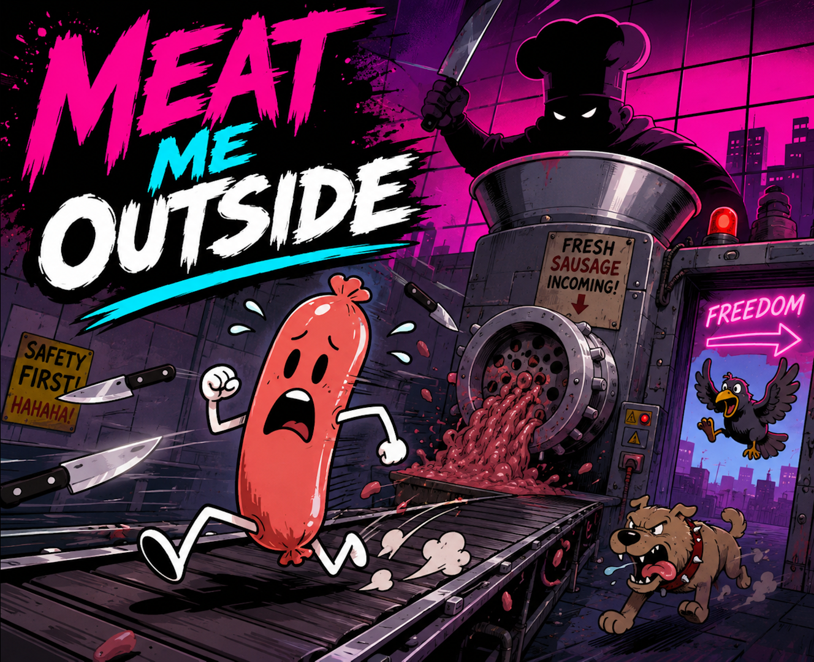
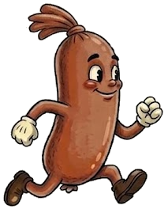

# Die Wurst

## DE

**Die Wurst** ist ein chaotisches Arcade-Spiel aus einem 48-Stunden-Gamejam.

Du spielst ein Wuerstchen auf dem Fliessband, rennst dem Fleischwolf davon, weichst herumfliegendem Unsinn aus und sammelst andere Wuerstchen zu einer immer fragwuerdigeren Kette ein.

### Kurz gesagt

- Auf dem Fliessband ueberleben
- Geworfenen Objekten und anderem Chaos ausweichen
- Eine Wurstkette bauen
- So lange wie moeglich nicht im Wolf enden

Jam-Thema: **Verbindung**

Kurzfassung:
Zu viele Wuerste. Zu wenig Sicherheit. Genau richtig.

## EN

**Die Wurst** is a chaotic arcade game made during a 48-hour game jam.

You play as a sausage on a conveyor belt, run from the meat grinder, dodge airborne nonsense, and collect other sausages into an increasingly questionable chain.

### In short

- Survive on the conveyor belt
- Dodge thrown objects and general chaos
- Build a sausage chain
- Avoid getting minced for as long as possible

Jam theme: **Connection**

Short version:
Too many sausages. Not enough safety standards. Just right.
